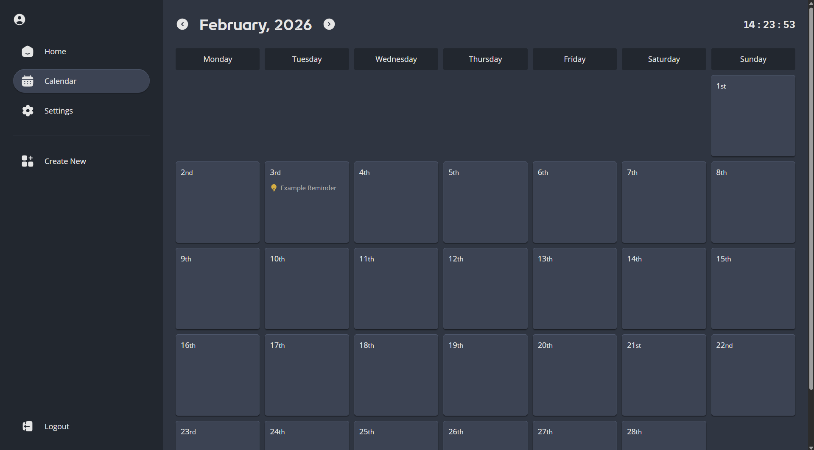

<h1 align="center">📍Dating App</h1> 
<p align="center"><b>Calendar app focusing on minimalistic design and user experience.</b></p>

<div align="center">


  
</div>


</br>



## Setup
Prerequisites: 
- Supabase account and database setup (more details below)
- npm already installed
- Git already installed
  
Follow these setup steps to run this project on your machine. 

``` console
// Clone repository from GitHub
$ git clone https://github.com/HarrisonBaghurst/personal-calendar

// Navigate to created directory
$ cd personal-calendar

// Install packages
$ npm install

// Create local variables file (more information below)

// Run development server
$ npm run dev

// Navigate to "localhost:3000"
```

### Supabase setup 

This project requires a Supabase account with a specific table name, fields and RLS policies to work out of the box.</br>
``` 
// Table name
full-schedule

// Table fields
id: int 8
created_at: timestamptz
title: text
date: date
location: text
cost: text
start_time: time
end_time: time
extra_info: text
type: text
user_id: uuid

// RLS policies
DELETE: enable delete for users based on user_id
INSERT: enable insert for users based on user_id
SELECT: enable users to view their own data only
```
You will also need to create a user as for security I didn't build a sign up page, only a sign in page. </br>
Make sure to store your Supabase url and api keys for later.

### Local variables
You will need to create a local variables file at the root of your project directory. 
```
.env.local

NEXT_PUBLIC_SUPABASE_URL=*****
NEXT_PUBLIC_SUPABASE_PUBLISHABLE_KEY=*****
SUPABASE_SERVICE_ROLE_KEY=*****
```

## Technologies
[](https://skillicons.dev)

## Todo List

### Features
- [ ] add meal event type 
- [ ] repeat frequency - dayly, weekly, monthly, annually
- [ ] add shopping list
- [ ] add count down event type 
- [ ] add to do list component
- [ ] load in animation
- [ ] add list view with filters for events
- [ ] add 'relevant to' highlight

### Bugs
- [ ] show incorrect password
- [ ] sidebar incorrect style on mobile
- [ ] current day highlight not showing
- [ ] toggles not showing border on hover

### Complete
- [x] ~~updated to pwa~~
- [x] ~~share event with sendable link~~
- [x] ~~event priority resetting on reload~~
- [x] ~~change event information~~ 
- [x] ~~custom event order~~
- [x] ~~add birthday event type~~
- [x] ~~add bill event type~~
